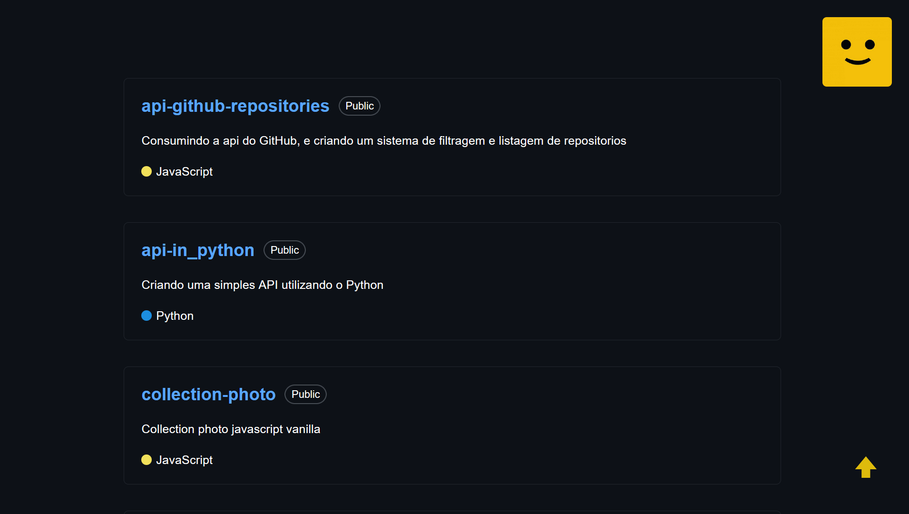

## <strong>README</strong>
### - CLONE REPOSITORIO

    git clone https://github.com/cezardev07/react-api-github.git

### - DEPENDENCIAS

    npm install

    npm install styled-components

    npm install react-icons 

### - START APLICATION REACT
    cd react-api-github
    npm run dev


<p>
  <a href="#-tecnologias">Tecnologias</a>&nbsp;&nbsp;&nbsp;|&nbsp;&nbsp;&nbsp;
  <a href="#-layout">Layout do projeto</a>&nbsp;&nbsp;&nbsp;|&nbsp;&nbsp;&nbsp;
</p>


<br>

<!-- <a href="https://cezardev07.github.io/filter-pokemon-api/" align="center">
  
</a> -->

<h2>PROJETO <strong>REACT</strong> CRIADO COM FOCO EM ESTUDAR:</h2>
</br>

- <strong>Components REACT:</strong>
 
```js
        import Component from "./../"
        
        const App = () => {
            return(
                <>
                    </Component>
                </>
            )
        }
        export default App
```
- <strong>Style Components REACT:</strong>
```js
        import styled from 'styled-components'

        export const Button = styled.button`
            cursor: pointer;
            backgraund: ${ props => langRepo.props === "JavaScript" 
                ? "#f1e05a"
                : "red"
            };
        `
```

- <strong>Hooks, useEffect e useState REACT:</strong>
```js
        import { useEffect, useState } from "react";
        
        const [items, setItems] = useState([])

        useEffect(() => {
            setItems()
        },[])
```

- <strong>Requisição assincrona REACT:</strong>
```js
        useEffect(() => {
            const get = async (ApiKey) => {
                try{
                    const response = fetch(Apikey)
                    const data = await response.json()
                    
                    setItems(data)
                } catch(error){
                    console.log(error)
                }
            }
            get(ApiKey)
        },[])
```

- <strong>API GITHUB:</strong>

- <strong>FETCH API:</strong>


</br>

## 🚀 TECNOLOGIAS

Esse projeto foi desenvolvido com as seguintes tecnologias:

- REACT
- STYLE COMPONENTS
- HOOKS REACT
- GET API REACT
- GIT e GITHUB

## 🔖 LAYOUT

<a href="https://github.com/cezardev07/react-api-github" align="center">
  
</a>